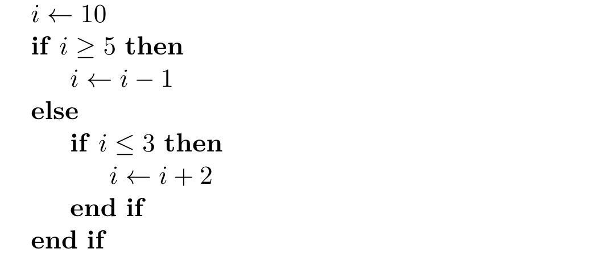

## Pseudo-code et algorithme

Un **algorithme** donne une façon de résoudre, étape par étape, un problème général (p.ex. trier des nombres dans l'ordre croissant).

Un **pseudo-code**, quant à lui, donne une "**façon de décrire** un **algorithme** en **langage presque naturel**, sans référence à un langage de programmation en particulier."
[source](https://fr.wikipedia.org/wiki/Pseudo-code)

Par conséquent, ce dernier ne devrait pas être ambigu.

---

Un pseudo-code peut se trouver à plusieurs niveaux d'abstraction, rentrant dans plus de détails si nécessaire.

Un haut niveau d'abstraction nous permettrait donc d'avoir une sorte de ligne directrice, garder une vue plus globale de ce qu'on veut obtenir et donc réfléchir à un peu plus haut niveau que celui du langage de programmation (ce dernier ayant une syntaxe particulière qui diffère avec d'autres langages).

---

Et donc si on reprend les étapes du cours:
1. **Définir le problème.**
2. **Déterminer la méthode de resolution (algorithmique).**
3. Écrire le programme correspondant (programmation).
4. Tester le programme.
5. (corriger, retourner ci-dessus...)
6. Intégrer le programme dans le système existant.
7. Tester l’intégration.
8. (corriger, retourner ci-dessus...)

On mettrait donc de l'importance sur les deux premières étapes qui ne dépendent généralement pas du langage de programmation !

**On devrait normalement donc réfléchir aux différentes instructions à un haut niveau avant de les écrire dans un code**

## Différents concepts/éléments

Les pseudo-codes peuvent utiliser: 

- variables et types
- opérateurs (arithmétiques (+, -, etc.), booléens (et, ou, etc.) etc.)
- contrôle de flux (boucles, conditions etc.)
- fonctions
- ...

sans avoir besoin d'utiliser la syntaxe d'un langage en particulier ! Et si vous préférez une certaine "convention", vous pouvez regarder: https://fr.overleaf.com/learn/latex/Algorithms

**Exemple:**

*(Explication en classe)*

## Exercice 1

Essayez de deviner (ou vous rappeler) ce que cela veut dire:

$x = x + 1$

où $x$ est une variable au sens informatique. Discutez entre vous !

**Indice:** L'instruction précédente est des fois écrite comme suit (dans des algorithmes en LaTeX par exemple):

$x \leftarrow x + 1$

**Réponse:** *(Explication en classe)*

