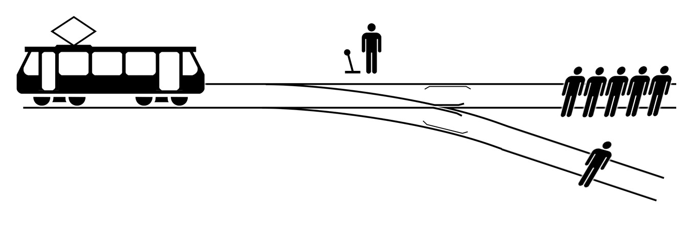

## Si ... Alors ... Sinon



Vous êtes confronté au dilemme du tramway (trolley problem), où tirer le levier cause la mort d'un proche mais ne pas le tirer revient à laisser $5$ inconnus mourir.

En pseudo-code (très informel et haut niveau), cela signifierait environ:

```
Si vous tirez le levier:
    (Alors) proche meurt
Sinon:
    5 inconnus meurent
```

Et en Python, c'est assez similaire, mais en anglais !

```python
if levier:
    print("Proche meurt")
else:
    print("5 inconnus meurent")
```
où `levier` est une variable qui est soit `True`, soit `False` et `print` permet d'afficher un texte sur notre écran. Notez qu'ici, déplacer le levier ne fait que d'afficher différents textes, au lieu de causer des décès.

Cette instruction `if` est utile pour avoir différents comportements. S'il y a plus de choix, vous pouvez utiliser `elif`. On reviendra dessus plus tard dans le cours.

## Exercice 2

Utiliser `if`, `else`, et `print` pour afficher si quelqu'un est majeur ou non. Commencez avec ce bout de code Python

```python
age = input("Entrez votre age: ")   # age est un texte (string)
age = int(age)                      # age est maintenant un entier (int)
print("Votre age est: ", age)
```
