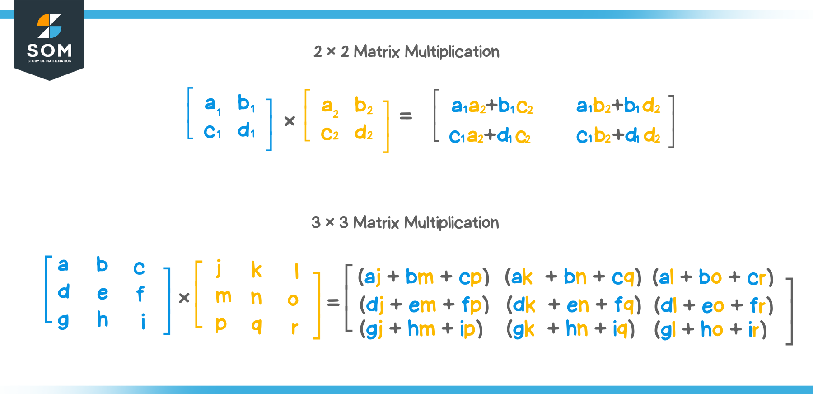
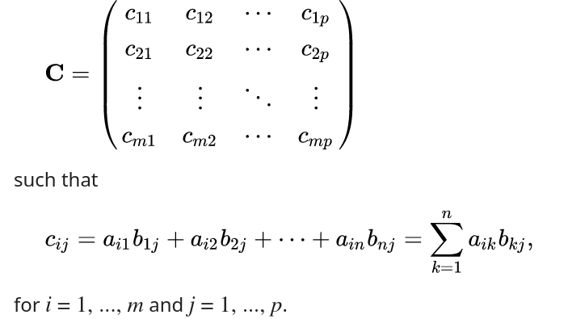

## Multiplication matricielle (pas un exercice, optionel)

Dans le code `matrix_multiplication.py`, on vous montre comment faire des multiplications matricielles
avec des listes en Python ou avec des tableaux (array) `numpy`.

Les boucles `for` suivent la méthode de multiplication matricielle qu'on aurait faite à la main:

Et donc on général, pour multiplier une matrice $A \in \mathbb{R}^{m \times n}$ avec une autre $B \in \mathbb{R}^{n \times p}$ et obtenir $C \in \mathbb{R}^{m \times p}$, on peut utiliser la formule ci-dessous

On aurait donc $3$ boucles, deux pour avoir $m \times p$ éléments et une pour la somme. 