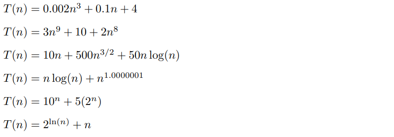

# [11X001] TD n°8

---

Université de Genève, cours [11X001 Introduction à la Programmation des Algorithmes](https://wwwi.unige.ch/cursus/programme-des-cours/web/teachings/details/2021-11X001).

---

## Exercice 0 - Complexité

Pour chaque expression ci-dessous, indiquez le terme dominant et dire quelle est la complexité de `T(n)` avec la notation `O(...)` en essayant d’avoir la borne la plus stricte possible (c'est-à-dire si `T(n)` a une complexité en `O(n^2)`, ne répondez pas `O(n^3)` même si c'est vrai en principe).

**Exemple** : Pour `T(n) = 18n^3 + 2log(n)`, le terme dominant est `18n^3` et la complexité est `O(n^3)`.



---

## Exercice 1 - Distance de Hamming

**TODO** : Compléter la fonction `hamming` qui prend en entrée deux chaines de caractères et qui retourne un entier correspondant à la distance de Hamming entre ces deux chaines de caractères. Si les deux chaines ne font pas la même longueur, cette fonction retourne -1.

**Remarque** : La fonction `exercice1` est déjà implémentée pour vous. Elle demande deux chaines de caractères à l'utilisateur et appelle la fonction `hamming` sur ces deux chaines.

**Rappel** : Pour deux chaines de caractères de même longueur, la [distance de Hamming](https://fr.wikipedia.org/wiki/Distance_de_Hamming) est définie comme le nombre de positions où les deux chaines diffèrent.

---

## Exercice 2 - Recherche de mot par force brute

**TODO** : Compléter la fonction `recherche_mot_force_brute` qui prend en arguments deux chaines de caractères correspondant à un mot et un texte. Elle renvoie un entier correspondant à la position de la première occurence du mot dans le texte. Elle renvoie -1 si le mot n'est pas trouvé dans le texte.

La fonction `exercice2` est déjà implémentée. Elle demande à l'utilisateur un mot et un texte, appelle votre fonction `recherche_mot_force_brute` et affiche le résultat.

---

## Exercice 3 - Distance de Levenshtein

**Définition** : Pour deux chaines de caractères, la [distance de Levenshtein](https://fr.wikipedia.org/wiki/Distance_de_Levenshtein) est égale au nombre minimal de caractères qu'il faut supprimer (s), insérer (i) ou remplacer (r) pour passer d’une chaîne à l’autre.

**Exemples** : 

- `levenshtein(mots, mois) = 1` (1r : remplacer `t` par `i`)
- `levenshtein(janvier, février) = 4` (4r : remplacer `janv` par `févr`)
- `levenshtein(dentiste, dent) = 4` (4s : supprimer `iste`)
- `levenshtein(niche, chien) = 4` (2s + 2i : supprimer `ni` puis insérer `i` entre `h` et `e` puis insérer `n` à la fin)
- `levenshtein(un peu, beaucoup) = 7` (2i + 5r : remplacer `un pe` par `eauco`, insérer `b` au début et `p` à la fin)

**Principe** : 

Soient `a` et `b` deux chaines de caractères, par exemple `a = "niche"` et `b = "chien"`. 
Le principe est de construire une matrice D de taille `(len(a) + 1) x (len(b) + 1)`  telle que `D[i][j]` contienne la distance de Levenshtein entre `a[:i]` et `b[:j]`.

```bash
      c h i e n

    0 1 2 3 4 5
n   1 1 2 3 4 4
i   2 2 2 2 3 4
c   3 2 3 3 3 4
h   4 3 2 3 4 4
e   5 4 3 3 3 4
```

Ici:

- `D[0][0] = 0` car c'est la distance entre '' et ''.
- `D[0][3] = 3` car c'est la distance entre '' et 'chi' (3 insertions).
- `D[1][5] = 4` car c'est la distance entre 'n' et 'chien' (4 insertions).
- `D[4][2] = 2` car c'est la distance entre 'nich' et 'ch' (2 insertions).

Pour remplir correctement cette matrice, on remarquera que dans tous les cas :

```python
D[i][0] = i     # distance entre le préfixe de taille i de a et la chaine vide.
D[0][j] = j     # distance entre la chaine vide et le préfixe de taille j de b.
D[i][j] = min(
    D[i - 1][j] + 1,        # suppression
    D[i][j - 1] + 1,        # insertion
    D[i - 1][j - 1] + 1     # remplacement
) 
```

Une fois cette matrice complétée, la distance de Levenshtein est bien sûr donnée par `D[len(a)][len(b)]`.

**TODO** : 

- Coder une fonction `levenshtein` qui prend en entrée deux chaines de caractères et qui retourne un entier correspondant à la distance de Levenshtein entre ces deux chaines de caractères. 
- Compléter la fonction `exercice3` en vous inspirant de la fonction `exercice1` afin d'appeler la fonction `levenshtein` sur deux chaines demandées à l'utilisateur.

