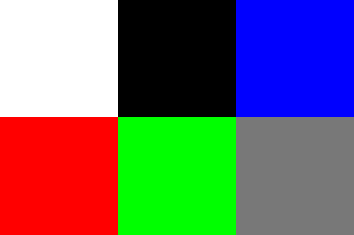
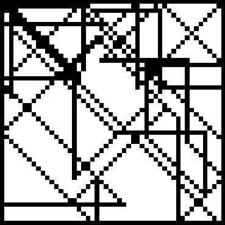
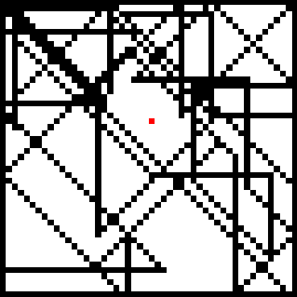
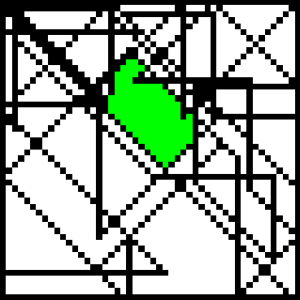
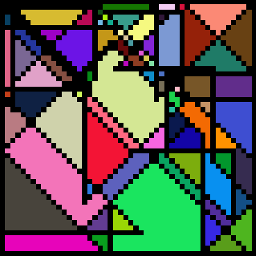

# [11X001] TD facultatif n°1 - Coloriage

---

Université de Genève, cours [11X001 Introduction à la Programmation des Algorithmes](https://wwwi.unige.ch/cursus/programme-des-cours/web/teachings/details/2021-11X001).

---

## Représentation d'une image

Un pixel est représenté par un `tuple` de 3 valeurs entre `0` et `255` correspondants au rouge, au vert et au bleu (RGB pour red green blue). 

Par exemple : 
- `(0, 0, 0)` correspond à un pixel noir.
- `(255, 255, 255)` correspond à un pixel blanc.
- `(255, 0, 0)` correpond à un pixel rouge.
- `(120, 0, 0)` correspond à un pixel rouge un peu plus sombre.

On représente une image de taille H x W pixels par une liste de longueur H dont chaque élément est une liste de longueur W, contenant des tuples RGB. 

Ainsi le pixel (i, j) d'une image est un tuple RGB stocké à la j-ème position de la i-ème liste. 

Par exemple, l'image 2 x 3 suivante : 



sera représentée comme suit :

`[[(255, 255, 255), (0, 0, 0), (0, 0, 255)], [(255, 0, 0), (0, 255, 0), (120, 120, 120)]]`


---

## Exercice 1 - Commencer par colorier un pixel seul

A présent, nous considérerons des images de taille 50 x 50, avec un fond blanc et des compartiments délimités par des segments de pixels noirs :



La fonction `exercice1` contient déjà une ligne de code pour charger une image de ce genre dans la variable `image`, ainsi qu'une ligne pour l'afficher. 

```python
def exercice1():
    image = charger_coloriage("image.txt")
    # ******************** Votre code ci-dessous ********************

    # ******************** Votre code ci-dessus *********************
    afficher_coloriage(image)
```

**TODO** :
- Observer la fonction `colorier_pixel` : 

```python
def colorier_pixel(image, i, j, couleur):
    if image[i][j] != BLANC: # on ne veut colorier le pixel (i, j) seulement s'il est blanc
        return
    image[i][j] = couleur    # on colorie le pixel (i, j) avec la couleur demandée
```

Elle prend en arguments :
- `image` : une image représentée au format décrit précédemment.
- `i` et `j` : deux entiers qui représentent la ligne et la colonne du pixel que l'on souhaite colorier.
- `couleur` : un `tuple` de 3 valeurs RGB qui encode la couleur que l'on souhaite appliquer à notre pixel.

**Remarque** : Cette fonction ne retourne rien car on modifie directement la variable `image`. En effet, en Python, une liste est passée par *référence* à une fonction. 

**TODO** : 
- Dans la fonction `exercice1`, ajouter un appel à la fonction `colorier_pixel` pour colorier en rouge le pixel à la position (20, 25).


À présent, votre code doit afficher l'image suivante : 



---

## Exercice 2 - Identifier la récursion

Le but de cette section est de colorier non pas un pixel seul, mais tout le compartiment blanc qui entoure un pixel donné. 

La fonction `exercice2` est déjà complétée pour vous. 

```python
def exercice2():
    image = charger_coloriage("image.txt")
    colorier_compartiment(image, i=20, j=25, couleur=(0, 255, 0))
    afficher_coloriage(image)
```

Elle charge l'image que l'on souhaite colorier, appelle la fonction `colorier_compartiment` afin de colorier en vert (tuple `(0, 255, 0)`) le compartiment entourant le pixel (20, 25) et affiche le coloriage obtenu. 

**TODO** : 
- Compléter la fonction `colorier_compartiment(image, i, j, couleur)` afin que tous les pixels blancs dans le compartiment du pixel (i, j) soient coloriés de la couleur désirée.

À présent, votre code doit afficher l'image suivante : 



**Aide** : 
- Réfléchir à ce problème de façon **récursive** devrait être plus facile. Comment peut-on rappeler la fonction `colorier_compartiment` à bon escient ? Comment définir le cas d'arrêt ?

---

## Exercice 3 - Colorier l'ensemble de l'image

La fonction `exercice3` est similaire aux deux exercices précédents.


**TODO** : 
- Ajouter le code nécessaire dans la fonction `exercice3` afin de colorier tous les compartiments de l'image avec des couleurs aléatoires. 

À présent, votre code doit afficher l'image suivante (avec d'autres couleurs aléatoires) : 



**Aide** : 
- Vous devez bien sûr faire appel à votre fonction `colorier_compartiment` implémentée précédemment.
- Vous pouvez utiliser `couleur = obtenir_couleur_aleatoire()` pour obtenir une couleur aléatoire. 

**Remarque** : Vous pouvez remplacer la ligne 
```python
image = charger_coloriage("image.txt")
```

par 

```python
image = creer_coloriage_aleatoire() 
```

pour avoir un nouveau coloriage généré aléatoirement à chaque run. 

